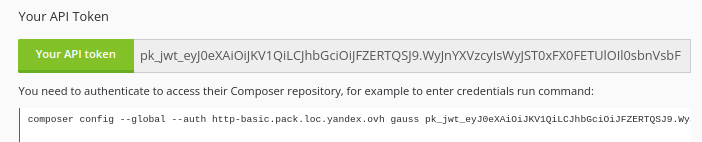

# JWT API Authentication

By default, packeton is storage api tokens in database for each user. But when user 
loaded from custom user provider, like LDAP need to enable JWT configuration to use API. So Packeton can be 
configured with a non-standard login type to support [JSON Web Tokens](https://en.wikipedia.org/wiki/JSON_Web_Token).

The JSON Web Token integration in Packeton uses the [Firebase library](https://github.com/firebase/php-jwt).
Also, JWT authentication can be enabled only for API.

Add `yaml` configuration file to path `config/packages/`, for example `config/packages/jwt.yaml` to enable it.

```yaml
packeton:
    jwt_authentication:
        private_key: '%kernel.project_dir%/var/jwt/eddsa-key.pem'
        public_key: '%kernel.project_dir%/var/jwt/eddsa-public.pem'
```

Full configurations: 

```yaml
# config/packages/config/packages/jwt.yaml
packeton:
    jwt_authentication:
        private_key: '%kernel.project_dir%/var/jwt/eddsa-key.pem' # required for token sign
        public_key: '%kernel.project_dir%/var/jwt/eddsa-public.pem' # required for token verification
        passphrase: ~
        algo: EdDSA # Sign algo, here libsodium EdDSA
```

## Generate the public/private keys

```
bin/console packagist:jwt:generate-keypair

bin/console packagist:jwt:generate-keypair --overwrite
```

Available options:
 * --overwrite will overwrite your keys if they already exist.

If keys already exists, a warning message will be raised to prevent you from overwriting your keys accidentally.

### JWT Token TTL.

JWT Token is never expire. It was done for compatibility with composer basic HTTP authorization.
Each time the api is called, Packeton is checked that the user exists in the database and that 
he has the same set of permissions and roles. 

### Digital signatures algos. 

We support all algos from Firebase lib: HMAC, OpenSSL RSA, OpenSSL

Rsa, HMAC, EdDSA algorithms generate invariant tokens, i.e. the value of the token will be constant for the same user.
It might be convenient as the app does not store the generated tokens. 

Example how to change algo:

```yaml 
packeton:
    jwt_authentication:
    ...
        algo: RS256 # RSA 256
```

### Generating keys using OpenSSL

Example, how to generate an RSA private key, `key.pem` - private key. `public.pem` - public

```
openssl genrsa -out key.pem 2048
openssl rsa -in key.pem -outform PEM -pubout -out public.pem
```

Example, how to generate an ES256 (elliptic curve) key pairs.

```
openssl ecparam -name prime256v1 -genkey -noout -out key.pem
openssl ec -in key.pem -pubout -out public.pem
```

## Obtain the token

You can run command `packagist:user:manager` to show the api token:

```
bin/console packagist:user:manager admin --show-token --token-format=jwt
```

Or you can found api token on your profile page. 

[](img/jwt_keys.png)

### Use the token

Simply use the JWT, like standard API token for composer api.

#### Cache LDAP user loading.

Since 2.0 composer downloads all packages in parallel, it may run more 12 request at the same time. 
To prevent calls external LDAP provider each time for JWT token verify, the obtained LDAP user object
placed to cache with 60 sec TTL. 
