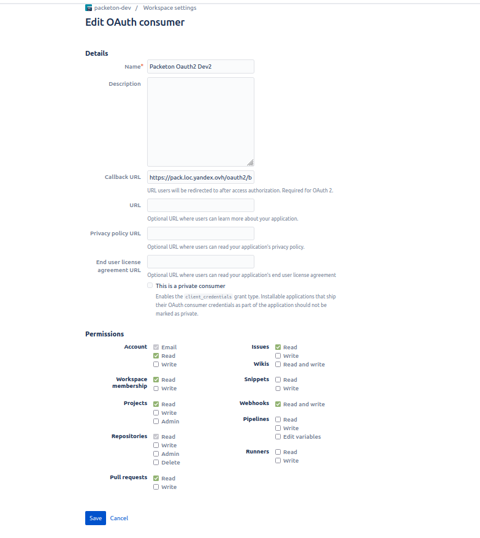

# Bitbucket Integration Setup

Go to you Bitbucket workspace settings (`https://bitbucket.org/{name}/workspace/settings/api`) and select "Add OAuth consumer".

[](../img/bitbucket.png)

Redirect Urls:

```
https://example.com/oauth2/{alias}/auto
```

The next step is obtain `Key`, `Secret` to creating a configuration in the yaml.
For docker installation you may use `config.yaml` file in docker volume.

```yaml
packeton:
    integrations:
        bitbucket:
            repos_synchronization: true
            pull_request_review: true
            bitbucket:
                key: GA7000000000000000
                secret: 9chxxxxxzxxxxxxxxeexxxxxxxxxxxxx
```

Now you can go to the Packeton integration page and click "Install Integration".
You will see list of available integrations and its Redirect Urls. Click to Connect to set up oauth2 credentials.
