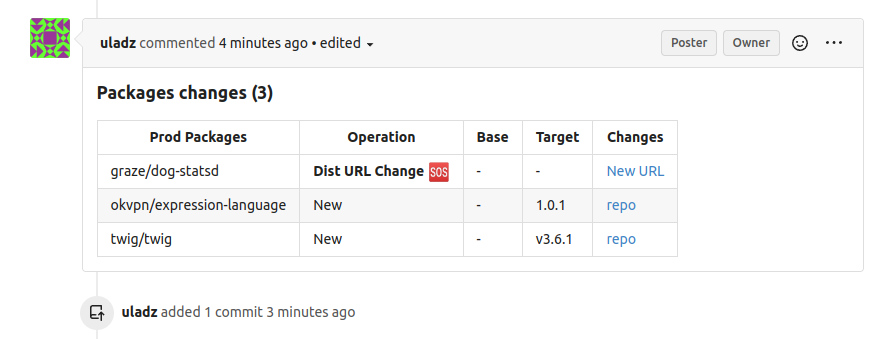

# Gitea Integration Setup

Go to you Gitea account settings (`https://git.example.com/user/settings/applications`) and select "Applications".

[](../img/gitea.png)

Redirect Urls:

```
https://example.com/oauth2/{alias}/auto
```

The next step is obtain `clinent_id`, `client_secret` to creating a configuration in the yaml. 
For docker installation you may use `config.yaml` file in docker volume.

```yaml
packeton:
    integrations:
        gitea:
            allow_login: true
            repos_synchronization: true
            pull_request_review: true
            base_url: 'https://git.example.com/'
            gitea:
                client_id: '44000000-0000-0000-0000-00000000000'
                client_secret: 'gto_acxxxxxxxxxxxxxxxxxxxxxxxxxxxxxxxxxxxxx'
#                api_version: 'v1'
```

Now you can go to the Packeton integration page and click "Install Integration". 
You will see list of available integrations and its Redirect Urls. Click to Connect to set up oauth2 credentials

#### Example of pull request review

[](../img/gitea2.png)
