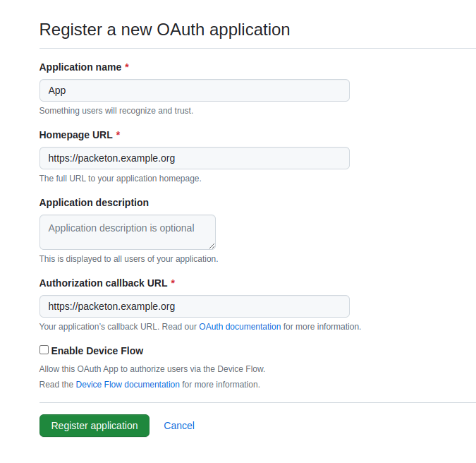

# GitHub OAuth2 Setup

Go to you GitHub account Settings / Developer settings (`https://github.com/settings/developers`) and select "New OAuth App"

Use the packeton host as "Callback URL / Redirect URL". For example `https://packeton.example.org`

[](../img/github-oauth2.png)

Use obtained `client_id`, `client_secret` to create configuration in yaml. For docker installation you may use `config.yaml` file in docker volume.

```yaml
packeton:
    integrations:
        github: # any alias name 
            allow_login: true 
            ... more options see oauth2 md
            gitlab: # Provider name: github, gitlab, bitbucket etc 
                client_id: 'xxx'
                client_secret: 'xxx'
```

Now go to Packeton integration page and click Install Integration. You will see a list of available integrations and its Redirect Urls

Click to `Connect` to set up oauth2 credentials.

[](../img/github-connect.png)
