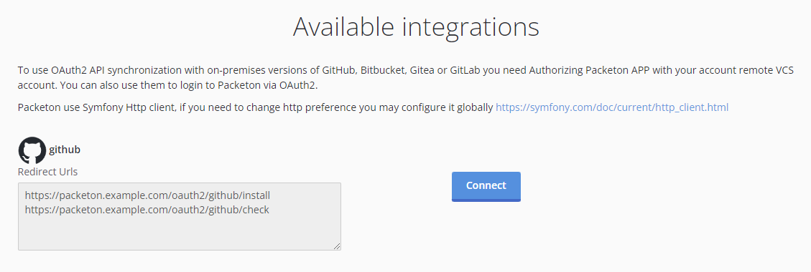

# GitHub App Integration

GitHub App Integration is alternative of GitHub OAuth2. 
To create GitHub go to: Settings / Developer settings / GitHub Apps and click `New GitHub App`.

- Enter a GitHub App name: Private Packeton.
- Enter a homepage url: https://packeton.example.com for example.
- Click `Add Callback URL` and use the next "Callback URL / Redirect URL".
```
https://packeton.example.com/oauth2/{alias}/install
https://packeton.example.com/oauth2/{alias}/check
```

- Uncheck webhook active checkbox

Select Repository permissions:
- Content: read-only 
- Webhooks: read-write
- Metadata: read-only (already selected)
- Pull requests read-write 

Select Organization permissions:
- Webhooks: read-write
- Members: read (optional)

[](../img/githubapp1.png)

After creating App go to App view page and find `app_id` and generate a "Private Key"

The next step is creating of configuration in yaml.
For docker installation you may use `config.yaml` file in docker volume.

```yaml
packeton:
    integrations:
        github:
            repos_synchronization: true
            pull_request_review: true
            ... 
            githubapp:
                private_key: '/data/packeton-key.pem'
                app_id: 340120
```

When you must install GitHub App in your GitHub Account. 

Go to public App page, like `https://github.com/apps/{name}` and click configure. 
Select your organization or own account.

[](../img/githubapp2.png)

After install you will see `installation_id` on URL address. For example `https://github.com/settings/installations/38069000`

Now go to Packeton `integration` page and click `Install Integration`. 
When click to `Connect` under you `github` configuration.

[](../img/githubapp4.png)

To finish setup Go to Packeton `integration` view page / Settings and provider `installation_id` in the form

[](../img/githubapp3.png)
