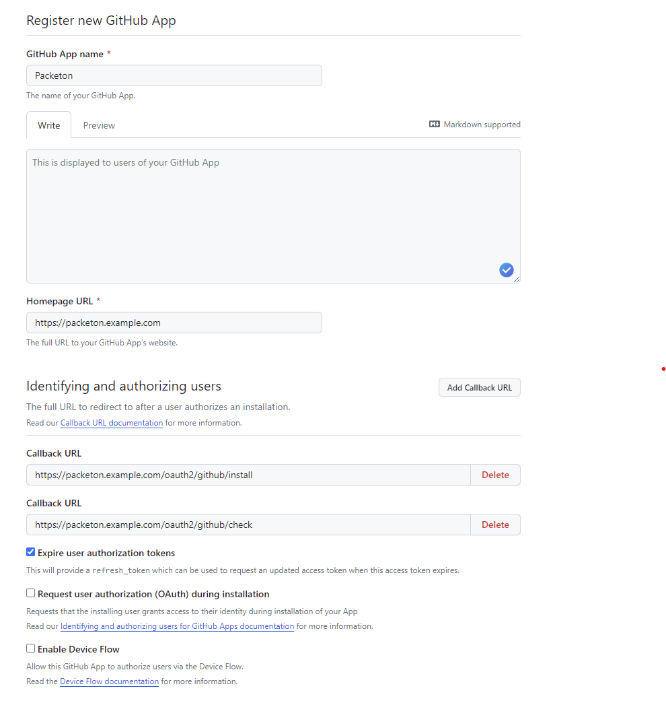
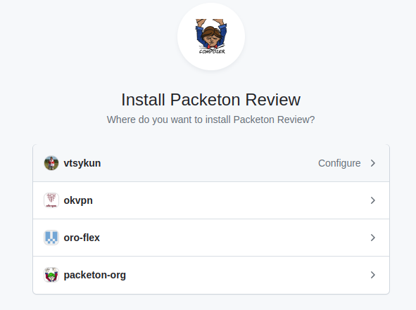
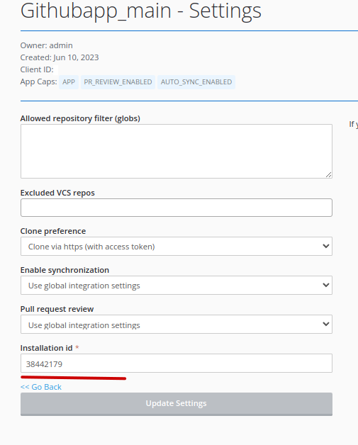

# GitHub App Integration

GitHub App Integration is alternative of GitHub OAuth2. To create GitHub go to 
Settings / Developer settings / GitHub Apps and click New GitHub App.

Use the next "Callback URL / Redirect URL".

Redirect Urls:

```
https://example.com/oauth2/{alias}/install
https://example.com/oauth2/{alias}/check
```

The webhooks URL maybe any. We don't use it and setup webhooks per repository or choice organization.

Select Permissions: 
- Webhooks read-write (Repository permissions)
- Metadata (Repository permissions)
- Pull requests read-write (Repository permissions)
- Webhooks read-write (Organization permissions)
- Members read (Organization permissions) - optional

[](../img/githubapp1.png)

After creating App go to App view page and find `app_id` and generate a "Private Key"

The next step is creating of configuration in yaml.
For docker installation you may use `config.yaml` file in docker volume.

```yaml
packeton:
    integrations:
        github:
            repos_synchronization: true
            pull_request_review: true
            ... 
            githubapp:
                private_key: '/data/packeton-key.pem'
                app_id: 340120
```

When you must install GitHub App in you Github Account. Go to public App page, like `https://github.com/apps/{name}`
and click configure. Select you organization or own account.

[](../img/githubapp2.png)

After install you will see `installation_id` on URL address. For example `https://github.com/settings/installations/38069000`

Now go to Packeton integration page and click Install Integration. When click to Connect under you githubapp configuration.

To finish setup Go to Packeton integration view page / Settings and provider `installation_id` in the form

[](../img/githubapp3.png)
