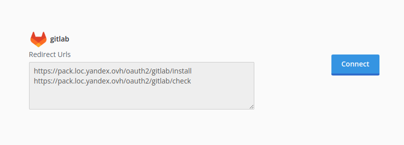

# GitLab Integration Setup

Go to you GitLab account preferences (`https://gitlab.example.com/-/profile/preferences`) and select "Applications"

[](../img/gitlab-app.png)

Redirect Urls:

```
https://example.com/oauth2/{alias}/install
https://example.com/oauth2/{alias}/check
```

Select the `api`, `read_user`, `read_repository` scopes and save the new application. The redirect urls you may change later.

Use obtained `client_id`, `client_secret` to create configuration in yaml. For docker installation you may use `config.yaml` file in docker volume.

```yaml
packeton:
    integrations:
        gitlab: # - {alias}
            base_url: 'https://gitlab.example.com/'
            clone_preference: 'clone_https' # Allows [api, clone_https, clone_ssh]
            ... more options see oauth2 md
            gitlab: # Provider name: github, gitlab, bitbucket etc 
                client_id: 'xxx'
                client_secret: 'xxx'
#                api_version: 'v4'
```

Now go to Packeton integration page and click Install Integration. You will see list of available integrations and its Redirect Urls

Click to Connect to setup oauth2 credentials

[](../img/gitlab-connect.png)

