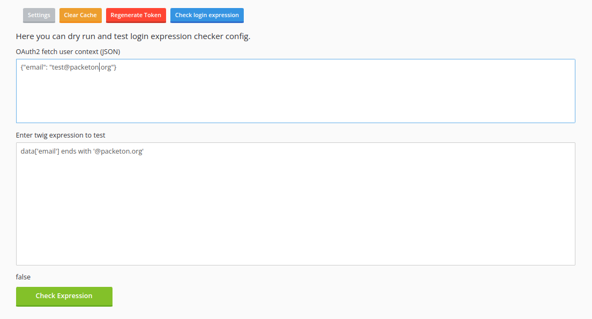

# Limit login/register with using expression lang

You may limit login with using expression, like symfony expression for access control. For evaluate expression
used TWIG engine with customization by this lib [okvpn/expression-language](https://github.com/okvpn/expression-language).
It allows to create a complex expressions where called team/members API to check that user belong to Organization/Repos etc.

Example usage 

```yaml
packeton:
    integrations:
        github:
            allow_login: true
            allow_register: true
            github:
                client_id: 'xxx'
                client_secret: 'xxx'
            login_control_expression: "data['email'] ends with '@packeton.org'"
```

Example 2. Here check GitLab's groups API.

```yaml
packeton:
    integrations:
        gitlab:
            allow_login: true
            allow_register: true
            gitlab:
                client_id: 'xx'
                client_secret: 'xx'
            login_control_expression: >
                
                
                
                    
                        
                    
                
    
                
                    
                
                    
                
                    
                
                
```

### Custom Twig function for expression lang

- `api_get(url, query = [], cache = true, app = null)` - Call get method 
- `api_cget(url, query = [], cache = true, app = null)` - Call get method with pagination with all pages.

By default, the API call results are cached, but you may overwrite with `cache` param.


`login_control_expression` - may return a bool result or list of roles. If returned result is empty - login/register is not allowed.

## Debug expressions 

You may enable debugging by param

```yaml
packeton:
    integrations:
        gitlab:
            login_control_expression_debug: true
            login_control_expression: "data['email'] ends with '@packeton.org'"
```

For localhost, you also can enable symfony dev env. But it's **strongly**  not recommended for prod for security reasons.
Then you may use `dump` action.

```
APP_ENV=dev
```

```twig



    
        
    





```

#### Example debug panel

When `login_control_expression_debug` is enabled you may evaluate script from UI.

[](../img/debug-expr.png)
