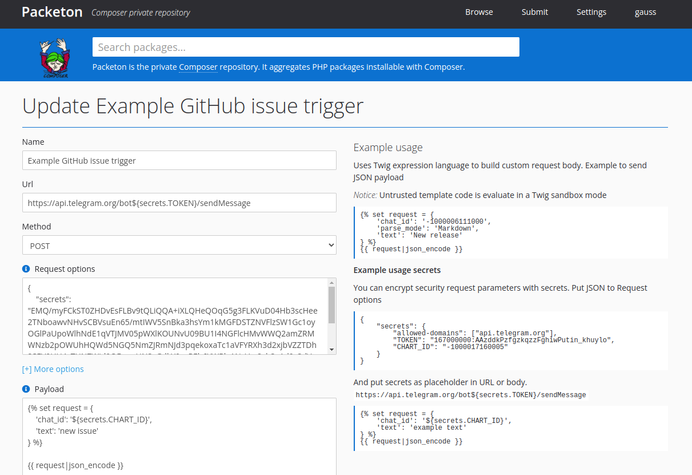
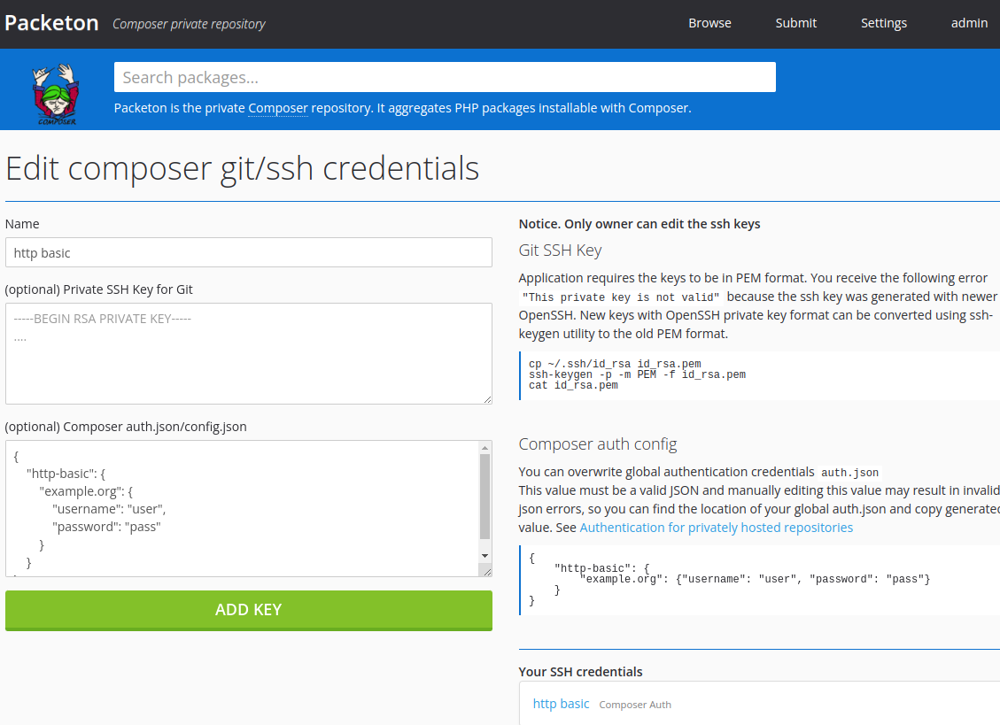
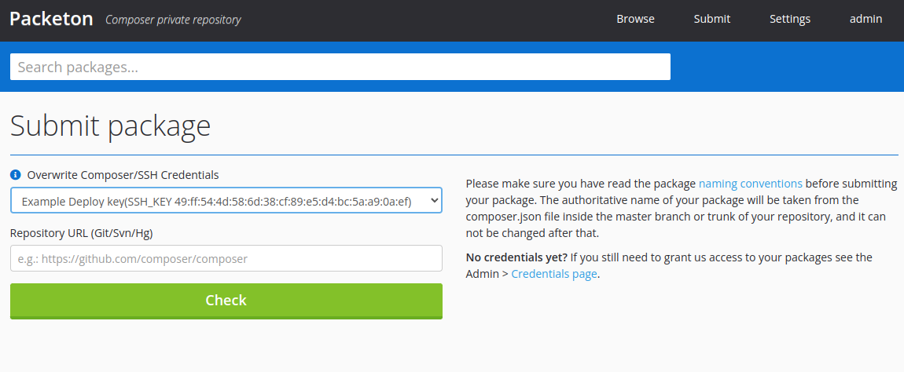
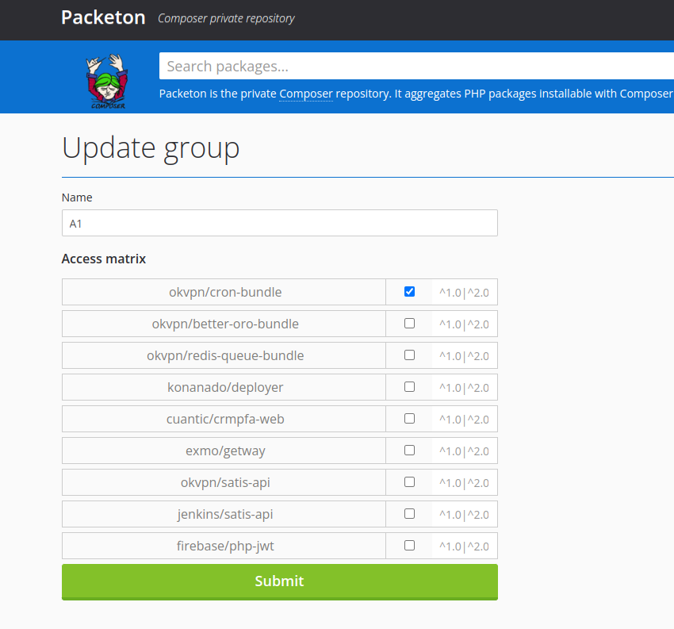
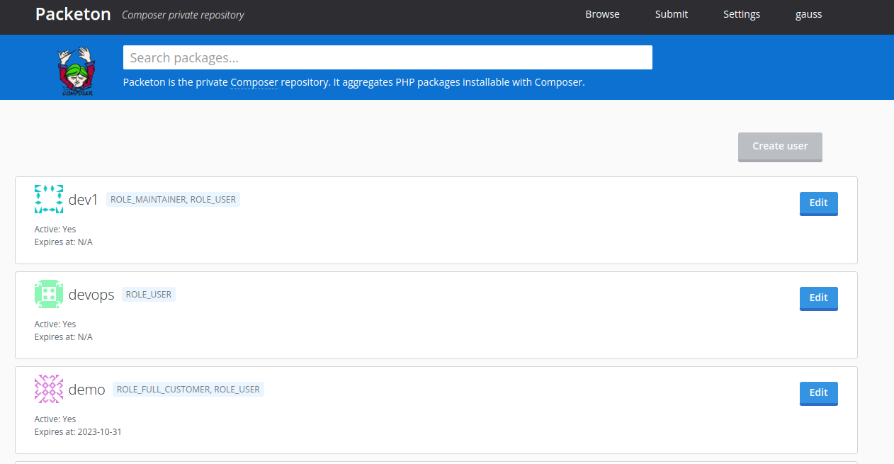
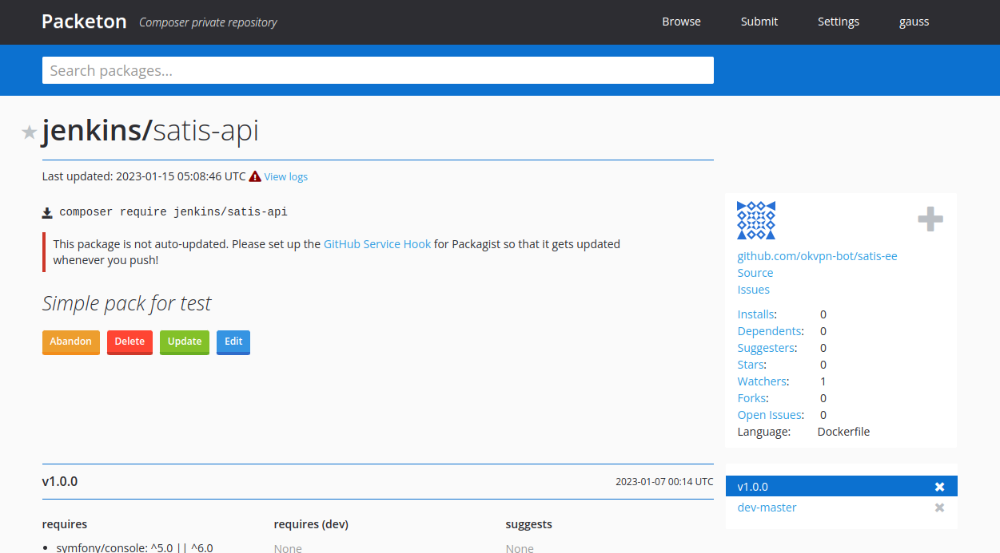

# Introduction

Packeton - Private PHP package repository for vendors. [GitHub Source Code](https://github.com/vtsykun/packeton)

Packeton is an open-source Composer repository homeserver for PHP private packages.
We began development in **2018**, bases on Packagist and Satis fork.

## Main Features

- Compatible with Composer API v2, bases on Symfony 5.4.
- Customers user and ACL groups and limit access by vendor and versions.
- Generic Packeton webhooks.
- Allow to freeze updates for the new releases after expire a customers license.
- Credentials and Authentication for privately hosted packages by oauth/http-basic config or ssh keys.
- Support update webhook for GitHub, Bitbucket and GitLab or custom format.

## Demo
See our [Administration Demo](https://demo.packeton.org). Username/password (admin/123456)

#### Create Webhooks

#### Webhooks status

#### SSH Keys

#### Submit

#### Groups

#### Users view

#### Package view

