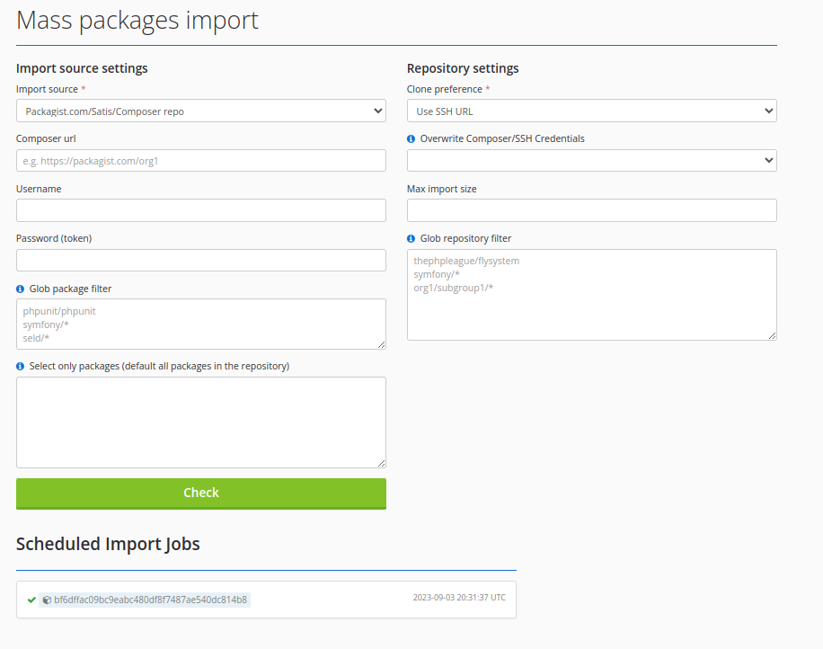

# Migrate from Packagist.com Satis

Packeton import provide interface to fast mass import all private packages from your onw composer repository, 
like Satis/Packagist. also you may use oauth2 integration to import all packages from your VCS hosting

[](../img/import.png)

Where

- `Glob package filter` - List of Glob to filter by package vendor name.

Example input value:

```
okvpn/*
org1/*
```

- `Select only packages (default all packages in the repository)` - used if composer repository does not provide API to fetch list of all packages. 
Put your composer.json, composer.lock, composer info output or packages names separated by spaces or line break

Example input value:

```
sebastian/cli-parser               2.0.0   Library for parsing CLI options
sebastian/code-unit                2.0.0   Collection of value objects that represent the PHP code units
sebastian/code-unit-reverse-lookup 3.0.0   Looks up which function or method a line of code belongs to
sebastian/comparator               5.0.1   Provides the functionality to compare PHP values for equality
sebastian/complexity               3.0.1   Library for calculating the complexity of PHP code units
sebastian/diff                     5.0.3   Diff implementation
sebastian/environment              6.0.1   Provides functionality to handle HHVM/PHP environments
sebastian/exporter                 5.0.0   Provides the functionality to export PHP variables for visualization
sebastian/global-state             6.0.1   Snapshotting of global state
sebastian/lines-of-code            2.0.1   Library for counting the lines of code in PHP source code
```

- `Clone preference` - used to select URL format. SSH or HTTPs clone.

