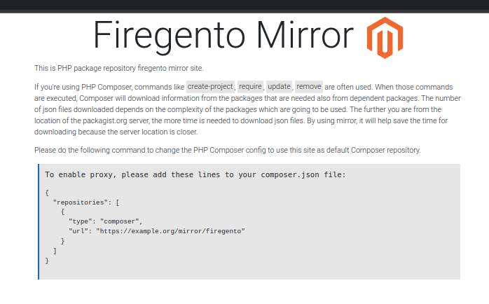

# Mirroring and Composer proxies

Packeton can function as a proxy for the Composer repository, including requiring an authorization.
This feature can be used to grant all developers and clients access to private repositories such as Magento.
Additionally, it is possible to create ZIP archives from mirrored Git repositories of packages, in cases where HTTP dist
is unavailable.

Main Features
-------------

- Supports full and lazy synchronization for small and large Composer repositories.
- Supports the Packagist fast `metadata-changes-url` API.
- Includes Strict Mode and Dependencies Approval functionality.
- Supports Dist/SSH mirroring of source code.

Example metadata with Strict mode and manual dependencies' approval.

```json
{
    "includes": {
        "include-packeton/all$f05f56b8bd12d014a753cdbe6a7d749facd40908.json": {
            "sha1": "f05f56b8bd12d014a753cdbe6a7d749facd40908"
        }
    },
    "mirrors": [
        {
            "dist-url": "/mirror/orocrm/zipball/%package%/%version%/%reference%.%type%",
            "preferred": true
        }
    ],
    "metadata-url": "/mirror/orocrm/p2/%package%.json",
    "available-packages": [
        "romanpitak/dotmailer-api-v2-client",
        "oro/platform-enterprise",
        "oro/crm-enterprise",
        "oro/api-doc-bundle",
        "oro/flotr2",
        "oro/crm-pro-ldap-bundle",
        "oro/multi-host",
        "akeneo/batch-bundle"
    ]
}
```

Original metadata is:

```json
{
    "packages": [],
    "providers-url": "/p/%package%$%hash%.json",
    "providers": {
        "actualys/drupal-commerce-connector-bundle": {
            "sha256": "4163f3b470b3b824cbcebee5a0d58ea3d516b7b5fa78617ba21120eeec9e494f"
        },
        "agencednd/oro-api-connector-bundle": {
            "sha256": "169c0963fd8442c190f2e9303e0e6fa1fe9ad0c9fb2f6782176d02e65a48eada"
        },
        "akeneo/batch-bundle": {
            "sha256": "4f2c1b9a43124524da45b35236acabd3ee1ad329980b885089e9eb408c1bca01"
        },
    ...
    + 57 packages
```

For performance if composer user-agent == 1 then `includes` replaced with `providers-lazy-url`


[](../img/packeton_proxies.png)

## Configuration

Example how to enable proxies in your local configuration.
To enable proxies in your local configuration, create a file with any name
like `config/packages/any-name.yaml` and add the following configuration:

```yaml
packeton:
    mirrors:
        packagist:
            url: https://repo.packagist.org
        orocrm:
            url: https://satis.oroinc.com/
            git_ssh_keys:
                git@github.com:oroinc: '/var/www/.ssh/private_key1'
                git@github.com:org2: '/var/www/.ssh/private_key2'
        example:
            url: https://satis.example.com/
            logo: 'https://example.com/logo.png'
            http_basic:
                username: 123
                password: 123
            public_access: true # Allow public access, default false
            sync_lazy: true # default false 
            enable_dist_mirror: false # default true
            available_package_patterns: # Additional restriction, but you can restrict it in UI
                - 'vend1/*' 
            available_packages:
                - 'pack1/name1' # but you can restrict it in UI
            composer_auth: '{"auth.json..."}' # JSON. auth.json to pass composer opts.
            sync_interval: 3600 # default auto.
            info_cmd_message: "\n\u001b[37;44m#Слава\u001b[30;43mУкраїні!\u001b[0m\n\u001b[40;31m#Смерть\u001b[30;41mворогам\u001b[0m" # Info message
```

The configuration allows you to use multiple SSH key settings for different GitHub accounts.

```
...
git_ssh_keys:
    git@github.com:oroinc: '/var/www/.ssh/private_key1'
    git@github.com:org2: '/var/www/.ssh/private_key2'

# Or one key
git_ssh_keys: '/var/www/.ssh/private_key1'
```

## Metadata Proxy Specification.

The specification for the metadata proxy depends on the type of repository and the synchronization strategy being used.

| API | Full sync                                      | Lazy sync          | Mirroring (strict)           |
|-----|------------------------------------------------|--------------------|------------------------------|
| V1  | provider-includes (parent)                     | providers-lazy-url | includes                     |
| V2  | meta v2 + available-packages (depends on size) | meta v2            | meta v2 + available-packages |


### Default sync intervals 

| Repo            | Interval in sec. |
|-----------------|------------------|
| Packagist.org   | 900              | 
| Lazy and API v2 | 1800             | 
| Lazy and API v1 | 7200             |
| Full            | 86400            |

### Commands for Debug

```
php bin/console packagist:sync:mirrors firegento -vvv

Description:
  Sync mirror repository proxy.

Usage:
  packagist:sync:mirrors [options] [--] [<mirror>]

Arguments:
  mirror                Mirror name in config file.

Options:
      --force           Remote all data and sync again
  -v|vv|vvv, --verbose  Increase the verbosity of messages: 1 for normal output, 2 for more verbose output and 3 for debug
```

## Manual Approval of Dependencies

By default, all new packages are automatically enabled and added to your repository when you run composer update. 
However, you can enable strict mode to use only approved packages and avoid including untrusted packages in your metadata. 
This can be useful in preventing dependency confusion attacks, especially if you use a 3rd-party Composer repository 
like `https://satis.oroinc.com/`. For more information on preventing dependency hacking, please see [dependency confusion](https://blog.packagist.com/preventing-dependency-hijacking) 

To enable strict mode, go to the Proxy Settings page and select Composer Proxies -> Packagist (or any other name) -> Settings.

[](../img/mirr1.png)

Next, go to the View Proxy page and click the "Mass Mirror Packages" button.

[](../img/mirr2.png)

## Mirror Public Access

Use the following configuration:

```yaml
packeton:
    mirrors:
        youname:
            url: https://repo.example.org
            public_access: true
```

[](../img/mirr3.png)
