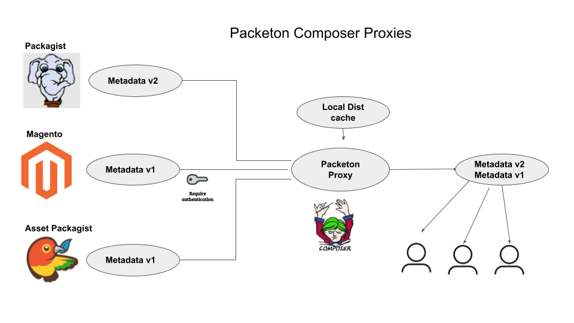

# Mirroring and Composer proxies

Packeton may work as a proxy for the composer's repository, including requiring an authorization.
This can be used to give all developers and clients access to private repositories like Magento.
Also, possible to create zip archives from git repositories of mirroring packages, if http dist is not available.

Main Features
-------------

- Support full and lazy sync for all - smail and big composer repositories.
- Support Packagist fast `metadata-changes-url` API.
- Strict mode and Dependencies approvement.
- Dist mirroring

Example metadata with Strict mode and manual dependencies approvement.

```json
{
    "includes": {
        "include-packeton/all$f05f56b8bd12d014a753cdbe6a7d749facd40908.json": {
            "sha1": "f05f56b8bd12d014a753cdbe6a7d749facd40908"
        }
    },
    "mirrors": [
        {
            "dist-url": "/mirror/orocrm/zipball/%package%/%version%/%reference%.%type%",
            "preferred": true
        }
    ],
    "metadata-url": "/mirror/orocrm/p2/%package%.json",
    "available-packages": [
        "romanpitak/dotmailer-api-v2-client",
        "oro/platform-enterprise",
        "oro/crm-enterprise",
        "oro/api-doc-bundle",
        "oro/flotr2",
        "oro/crm-pro-ldap-bundle",
        "oro/multi-host",
        "akeneo/batch-bundle"
    ]
}
```

Original metadata is:

```json
{
    "packages": [],
    "providers-url": "/p/%package%$%hash%.json",
    "providers": {
        "actualys/drupal-commerce-connector-bundle": {
            "sha256": "4163f3b470b3b824cbcebee5a0d58ea3d516b7b5fa78617ba21120eeec9e494f"
        },
        "agencednd/oro-api-connector-bundle": {
            "sha256": "169c0963fd8442c190f2e9303e0e6fa1fe9ad0c9fb2f6782176d02e65a48eada"
        },
        "akeneo/batch-bundle": {
            "sha256": "4f2c1b9a43124524da45b35236acabd3ee1ad329980b885089e9eb408c1bca01"
        },
    ...
    + 57 packages
```

For performance if composer user-agent is not 1 we remove `includes` and use `providers-lazy-url`


[](../img/packeton_proxies.png)

## Configuration

Example how to enable proxies in your local configuration.
Create a file `config/packages/any-name.yaml` with config.

```yaml
packeton:
    mirrors:
        packagist:
            url: https://repo.packagist.org
        orocrm:
            url: https://satis.oroinc.com/
            git_ssh_keys:
                git@github.com:oroinc: '/var/www/.ssh/private_key1'
                git@github.com:org2: '/var/www/.ssh/private_key2'
        example:
            url: https://satis.example.com/
            logo: 'https://example.com/logo.png'
            http_basic:
                username: 123
                password: 123
            sync_lazy: true # default false 
            enable_dist_mirror: false # default true
            available_package_patterns: # Additional restriction, but you can restrict it in UI
                - 'vend1/*' 
            available_packages:
                - 'pack1/name1' # but you can restrict it in UI
            composer_auth: '{"..."}' # JSON. auth.json to pass composer opts.
            sync_interval: 3600 # default auto.
            info_cmd_message: "\n\u001b[37;44m#Слава\u001b[30;43mУкраїні!\u001b[0m\n\u001b[40;31m#Смерть\u001b[30;41mворогам\u001b[0m" # Info message
```

## Metadata proxy specification.

It depends on the type of repository and sync strategy.

| API | Full sync                                      | Lazy sync          | Mirroring (strict)           |
|-----|------------------------------------------------|--------------------|------------------------------|
| V1  | provider-includes (parent)                     | providers-lazy-url | includes                     |
| V2  | meta v2 + available-packages (depends on size) | meta v2            | meta v2 + available-packages |


### Default sync intervals 

| Repo            | Interval in sec. |
|-----------------|------------------|
| Packagist.org   | 900              | 
| Lazy and API v2 | 1800             | 
| Lazy and API v1 | 7200             |
| Full            | 86400            |

### Commands for Debug

```
php bin/console packagist:sync:mirrors firegento -vvv

Description:
  Sync mirror repository proxy.

Usage:
  packagist:sync:mirrors [options] [--] [<mirror>]

Arguments:
  mirror                Mirror name in config file.

Options:
      --force           Remote all data and sync again
  -v|vv|vvv, --verbose  Increase the verbosity of messages: 1 for normal output, 2 for more verbose output and 3 for debug
```

## Manual approve dependencies

By default, all new packages are automatically enabled and added to your repository then you run composer update. But you can 
enable strict mode to use only approved packages and avoid including into metadata untrusted packages.
This can be useful to prevent dependency confusion attacks, for example if you use 3-d party composer repo like this `https://satis.oroinc.com/`
See about [dependency confusion](https://blog.packagist.com/preventing-dependency-hijacking) 

To enable strict mode go to proxy settings page Composer proxies -> Packagist (or any name) -> Settings

[](../img/mirr1.png)

Next go to view proxy page and click "Mass mirror packages" button

[](../img/mirr2.png)
