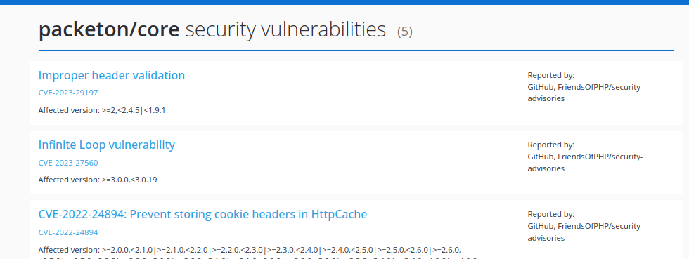

# Security Monitoring

Security Monitoring allow to send notifications when found a security problem in your `composer.lock`. By default, used packagist.org database.

Packeton is automatically check the main branch of every repository if the `composer.lock` is exists. 
You need to configure notifications webhook to receive notification if found a new security issue. 
Also, you may see list of security advisories in the package page.


[](../img/security.png)

## Configure Webhook Notifications

Go to Webhook page and click the "Add Webhook". Please fill the form.

| *Form*          | *Description*                                                                            |
|-----------------|------------------------------------------------------------------------------------------|
| Name            | Any name                                                                                 |
| Url             | Target url address. For example https://api.telegram.org/bot${secrets.TOKEN}/sendMessage |
| Method          | POST                                                                                     |
| Request options | Symfony HTTP client options (like custom headers, auth) JSON                             |
| Payload         | Twig render payload                                                                      |

For example request payload for telegram. It will send JSON request, because `response` is array

```twig


    
    
    





```

Twig vars:
`advisories` - list of advisories `Composer\Advisory\SecurityAdvisory`
`package` - package object.

Where `${secrets.CHART_ID}` `${secrets.TOKEN}` replace with secrets or hardcode this params. See [webhooks](../webhook.md) docs.
