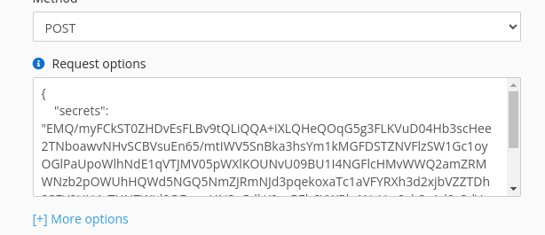

# Manage secrets

Before adding sensitive data such as API credentials to your webhook payload strongly 
recommended to encrypt it. Secret data will not be save to database or shows on webhooks' status. 
Alternative way you can set own visibility for webhook entity to prevent edit by other admin users.

### Encrypt secrets

To add secrets to your webhook, put JSON body to `Request options` field, for example

```json
{
//     "headers"  more other options 
    "secrets": {
        "allowed-domains": ["api.telegram.org"],
        "TOKEN": "167000000:AAzddkPzfgzkqzzFghiwPutin_khuylo",
        "CHART_ID": "-1000017160005"
    }
}
```

[](../img/secrets.png)

Once the form is submitted, the secret params will be encrypted and sign and cannot be changed.
The sign algo is hmac sha256 with `APP_SECRET` as key. Digital signature required to prevent modification
encrypted data and attack on change `allowed-domains` 

#### Secrets option

`allowed-domains` - you can restrict webhook call to untrusted hosts to prevent modify the change URL parameter.

### Usage secrets

Use secrets params in request, url or headers options, example:

```
https://api.telegram.org/bot${secrets.TOKEN}/sendMessage
```

In body

```twig

{{ request|json_encode }}
```

But this example will not work.

```twig

{% do log('${secrets.CHART_ID}')

{{ request|json_encode }}
```
